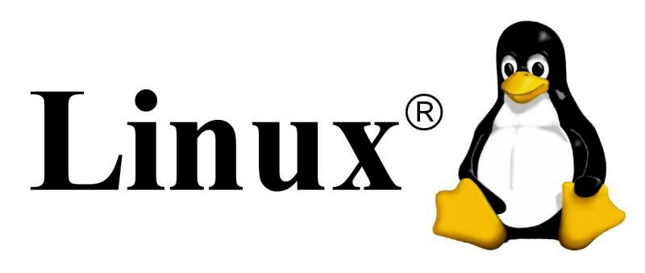

# Что такое Linux

<figure><figcaption></figcaption></figure>

Linux — это операционная система, основанная на ядре Linux, которое было создано Линусом Торвальдсом в 1991 году. Это свободное и открытое программное обеспечение (FOSS — Free and Open Source Software), что означает, что его код доступен для просмотра, модификации и распространения. Linux часто называют "ядром", поскольку сама операционная система состоит из множества компонентов, включая ядро, системные утилиты, библиотеки и пользовательские программы.

**Linux** не является прямой версией Unix, но он **Unix-подобный**.

Unix — это семейство многозадачных, многопользовательских операционных систем, разработанных в 1969 году в AT\&T Bell Laboratories Деннисом Ритчи и Кеном Томпсоном. Unix был создан как небольшая, простая и гибкая система, которая могла работать на различных типах компьютеров. Он стал основой для многих современных операционных систем, включая Linux, macOS и BSD.

Основные характеристики Unix:

* Многозадачность и многопользовательская работа.
* Иерархическая файловая система.
* Командная строка (shell) для управления системой.
* Модульная архитектура, позволяющая легко добавлять новые функции.

Linux следует философии Unix, использует схожую архитектуру и предоставляет аналогичные инструменты и интерфейсы.

**История создания Linux**

* **1991 год** — Линус Торвальдс, студент из Финляндии, начал работу над своим собственным ядром операционной системы, которое он назвал Linux. Его целью было создание бесплатной альтернативы коммерческому Unix.
* **1992 год** — Ядро Linux было выпущено под лицензией GNU General Public License (GPL), что сделало его частью экосистемы GNU, созданной Ричардом Столлманом.
* **1990-е годы** — Linux быстро набрал популярность благодаря сообществу разработчиков, которые начали создавать дистрибутивы Linux, включая Slackware, Debian и Red Hat.

**Версии и дистрибутивы**

На основе ядра созданы различные дистрибутивы (или версии) Linux, каждая из которых адаптирована под определённые задачи, пользовательские предпочтения или аппаратные платформы.

Дистрибутив (distribution) — это полная операционная система, которая включает в себя:

* Ядро Linux
* Системные утилиты
* Программное обеспечение
* Графическую среду пользователя (GUI)
* Дополнительные компоненты для работы с интернетом, офисными приложениями и т.д.

Каждый дистрибутив может иметь свои особенности: от интерфейса пользователя до способов установки и управления пакетами программ.

Некоторые популярные дистрибутивы:

* **Ubuntu** — Одна из самых популярных версий Linux, ориентированная на новичков. Базируется на Debian.
* **Debian** — Стабильный и надежный дистрибутив, используемый как для серверов, так и для домашних компьютеров.
* **Fedora** — Разрабатывается компанией Red Hat, фокусируется на новых технологиях и инновациях.
* **Red Hat Enterprise Linux (RHEL)** — Коммерческий дистрибутив, используемый в корпоративной среде.
* **CentOS** — Бесплатная версия RHEL.
* **Arch Linux** — Минимальный и гибкий дистрибутив, требующий ручной настройки.
* **openSUSE** — Дистрибутив с открытым исходным кодом, разрабатываемый компанией SUSE.
* **Kali Linux** — Специализированный дистрибутив для тестирования безопасности и взлома.

**Где используется Linux**

* Серверы — безопасность, стабильность, экономичность (например, Google, AWS).
* Облака — масштабируемость, контейнеризация (Docker, Kubernetes).
* Мобильные устройства — Android, энергоэффективность.
* Встраиваемые системы — умные часы, ТВ, автомобили (Tesla, Raspberry Pi).
* Суперкомпьютеры — высокая производительность, открытость.
* IoT — минимальные требования, безопасность.
* Развлечения — SteamOS, Kodi.
* Финансы — безопасность, устойчивость (NYSE).
* Образование — доступность, обучающая ценность (Edubuntu).
* Разработка — инструментарий, кроссплатформенность.

**Зачем уметь работать с Linux**

* **Широкая востребованность** — Linux используется практически во всех сферах IT — от серверов и облаков до мобильных устройств и суперкомпьютеров.
* **Безопасность и стабильность** — Linux является основой для многих критически важных систем, где важно минимизировать риск сбоев и атак.
* **Открытость и гибкость** — знание Linux позволяет настраивать систему под конкретные задачи и использовать огромное количество бесплатного программного обеспечения.
* **Карьера** — большинство компаний, работающих в сфере технологий, требуют навыков работы с Linux для разработчиков, администраторов и DevOps-специалистов.
* **Развитие компетенций** — работа в Linux помогает глубже понять внутреннее устройство операционных систем и улучшить навыки командной строки, что полезно для любого IT-специалиста.
